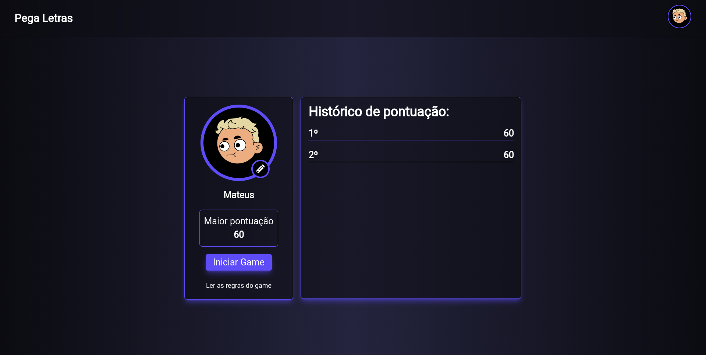

<h1>Olá, seja muito bem-vindo ao Pega-Letras</h1>

## Sobre a aplicação:

  - Este é um MiniGame onde o objeto é você apertar o máximo de teclas na sequência correta. Quanto mais teclas você acertar, mais pontos você acumula.
  - Cada acerto vale <b>10 pontos</b>, não existe uma pontuação máxima ou um limite de pontuações.
  - Se você apertar uma tecla errada, fora de ordem ou o tempo limite acabar, o jogo termina.
  - O tempo limite do Jogo é de <b>100 segundos</b>.
  - O Jogo é totalmente responsivo, então caso queira jogá-lo no celular, também possível.

<div style='flex'>
  
</div>

## Tecnologias utilizadas:
  - <b>Next.js</b> como principal ferramenta de desenvolvimento;
  - <b>URL State</b> para o gerenciamento de alguns estados;
  - <b>LocalStorage</b> para armazenamento de dados do usuário, já que está é uma aplicação Front-End e não possui comunicação com um servidor Back-End ou similar. 

## Iniciando a aplicação:

  - Certifique-se de ter o <b>Node</b> instalado em sua máquina.
  - Faça o clone da aplicação em sua máquina.
  - Execute o comando ```npm install```
  - Após instalar todas as dependências, execute ```npm run dev``` e divirta-se!

## Ah! Caso tenha alguma dúvida no jogo, não hesite em consultar as regras.
